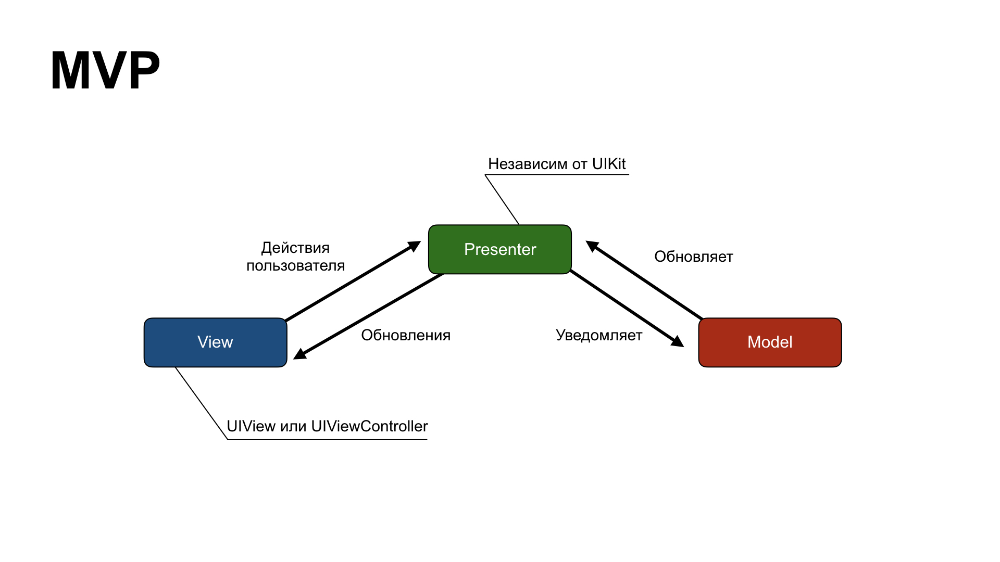
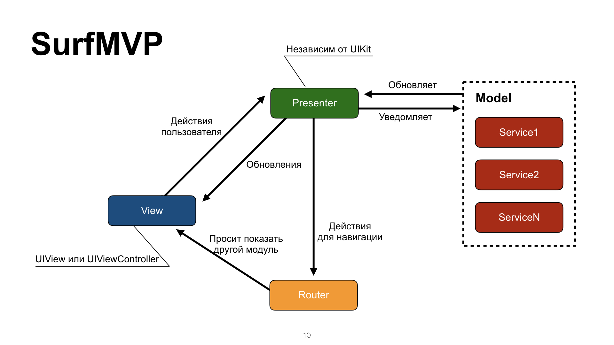
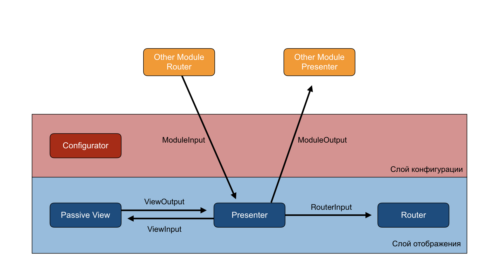

# Surf MVP

**Contents**

- [Surf MVP](#surf-mvp)
- [Foreword](#foreword)
    - [The layer of business logic](#the-layer-of-business-logic)
- [Architecture in detail](#architecture-in-detail)
      - [What we added](#what-we-added)
    - [Inter-layer communications](#inter-layer-communications)
  - [View](#view)
    - [ViewInput](#viewinput)
    - [ViewOutput](#viewoutput)
    - [ModuleTransitionable](#moduletransitionable)
          - [Implementing a custom transition](#implementing-a-custom-transition)
  - [Presenter](#presenter)
    - [ModuleInput](#moduleinput)
    - [ModuleOutput](#moduleoutput)
  - [Router](#router)
    - [RouterInput](#routerinput)
  - [Configurator](#configurator)
- [Best practices](#best-practices)
  - [Handling collections](#handling-collections)
    - [Adapters](#adapters)
    - [ReactiveDataDisplayManager](#reactivedatadisplaymanager)
  - [Interacting with UIAlertController](#interacting-with-uialertcontroller)
- [Code generation](#code-generation)
    - [Integrating Surf MVP](#integrating-surf-mvp)
      - [Surf MVP and an already existing project](#surf-mvp-and-an-already-existing-project)
      - [Surf MVP in a new project](#surf-mvp-in-a-new-project)
      - [If your project has no Unit Tests](#if-your-project-has-no-unit-tests)
- [Test project](#test-project)

# Foreword

Developing and supporting a large number of applications comes with a slew of challenges. These are usually associated with structuring a code base and sharing it between apps.

Suppose each project had its own standards. Then switching back and forth between them would inevitably cause developers to make mistakes, especially in code style.

We have introduced a standardized architecture with all the rules and interactions outlined. As a result, developers can write proper, well-structured code in projects while also switching between them easily.

An MVP pattern is our standard for developing the UI layer in applications. It helps address the following aspects of creating and supporting quality products:
- **Testability** — MVP has business logic separated from ViewController and isolated with protocols, so it can easily be covered with tests.
- **Reusability** — MVP has its modules isolated from each other. Hence, they can be easily reused within the same or different apps.
- **Separation of concerns** — MVP has all concerns clearly defined. Each component of a module is responsible for a specific task. Thanks to that, you can cut back on the number of lines of code per class.

### The layer of business logic

To implement business logic, we use service-oriented architecture (SOA). Here’s what it helps us address:
- Testability — SOA is a great fit for unit tests because the service is separated into layers. Each of them is in charge of a specific function. Thanks to that, it can be tested separately. SOA works with core components. They finally don’t need to be tested.
- Reusability — services contain parts of business logic. They can be easily integrated into various apps.
- Separation of concerns — services distinctly separate concerns of accessing the network and the base from interim layers.

We implemented this architecture solely based on the concepts of "Clean Architecture" and "SOLID" introduced by Robert Martin.

# Architecture in detail

The bedrock of SurfMVP is the classic MVP (Model View Presenter), which is a UI design pattern.



<p align="center">A classic MVP module</p>

- View: displays data on the screen and notifies the Presenter about user actions. It’s passive: the View never requests data; it only receives it from the Presenter.
- Presenter: receives information on user actions from the View and reacts to them. Provides the Model with events to be updated or processed there. Doesn't have to know anything about the UIKit except for the UIImage.
- Model: contains all the business logic needed for a module to function.

#### What we added

* There’s now a separate entity called **Configurator** in charge of building an isolated module. It initializes all the necessary components and allocates dependencies between them.

* We’ve noticed some issues arise when users navigated between screens in iOS apps. A lot of logic in charge of creating new screens before the transition was accumulated directly in the UIViewController, which didn’t seem right to us. That’s why, first off, we isolated an entity called **Router** and put it in charge of screen-to-screen transitions in apps.

* In SurfMVP, a Model is a service called by the Presenter to obtain data. Oftentimes, one service addresses the needs of an entire module, but in more complex situations it takes several of them



<p align="center">A module in Surf MVP</p>

### Inter-layer communications

The main feature of SurfMVP is that each layer is separated from the others by a protocol. The diagram above shows the layers and protocols connecting them. Protocols are in place to keep each layer separate from the others and, in theory, make them easy to replace. None of the layers should disclose implementation details.


<p align="center">Layers in SurfMVP</p>

**Let’s look at each one of them:** 

## View

View holds both presentation logic and the logic of filling itself with data. It passes all the user actions to the Presenter.

### ViewInput

ViewInput is implemented by the View itself, with the link to it kept in the Presenter. This protocol defines the methods enabling the Presenter to manage the View, pass data, alter states, etc.

Here’s an example ViewInput of a view presenting a user profile and subscription type.

```swift
protocol ProfileViewInput: class {

    /// Method for setup initial state of view
    func setupInitialState()

    /// Method for fill view fields with UserProfile
    func configure(with profile: UserProfile)

    /// Method for fill view fields with Subscription
    func configure(with subscription: Subscription)

}
```

> Methods that configure the View with the help of a certain parameter should be named in accordance with the example above. That’s a matter of standardization.

### ViewOutput

ViewOutput is implemented by the Presenter, with the link to it kept in the View. The protocol defines a set of actions that can happen in the View and lifecycle methods, such as touch interaction events.

Here’s an example ViewOutput of the above view. Here, users are able to reload their data or edit their profiles.

```swift
protocol ProfileViewOutput: class {

    /// Notify that view is ready
    func viewLoaded()

    // Notify that need reload view data
    func reload()

    // Notify that need edit profile
    func editProfile()

}
```

<details>
<summary>Naming rules for ViewInput and ViewOutput methods</summary>

Speaking of the *ViewInput* and *ViewOutput* protocols, a lot of people make mistakes in method names by disclosing the implementation details of a View.

**Bad example:**

```swift
func loginButtonClick()
```

**Good example:**

```swift
func login()
```

> We communicate user intent without clinging to the implementation details of a View. If this button is then replaced with a cell, you won’t have to change anything in the protocol.

**Another bad example:**

```swift
func reloadTable()
```

**Good example:**

```swift
func reload()
```

> Try not to cling to the implementation details of a View. That way, you can swap the table for a Collection View at any time without changing the protocol.

**Yet another bad example:**

```swift
func configureTableViewAdapter(with: SomeParameter)
```

**Good example:**

```swift
func configure(with: SomeParameter)
```

> We don’t disclose to the Presenter the way this view is implemented. It doesn’t know what the View is like. It only sees a set of methods it can use to interact. By entering the method called *configureTableViewAdapter*, we were telling it that the View contains a table.

</details>

### ModuleTransitionable

ModuleTransitionable is a protocol implemented by the View, with the link to it kept in the Router. It’s the only “generic” protocol in SurfMVP. Its role is to provide the Router with a set of methods to handle navigation around an app.

You can see the way it is implemented in [project templates](https://github.com/surfstudio/Xcode-Project-Templates/blob/master/Surf%20MVP%20Application.xctemplate/Support/ModuleTrasitionable.swift). I’d recommend initializing a project from a template instead of copying a file.

Since this protocol has a generic implementation, none of the generic presentation methods need to be implemented every single time.

###### Implementing a custom transition

If you need to create a custom transition between modules:
- Create your CustomModuleTransitionable protocol
- Implement the ModuleTransitionable protocol with it
- Implement the View
- Remember to edit the link in the Router

An example of a custom transition:

```swift
protocol CustomModuleTransitionable: class, ModuleTransitionable {
    func showModuleWithCustomTransition(_ module: UIViewController)
}

extension CustomModuleTransitionable  where Self: UIViewController {
    func showModuleWithCustomTransition(_ module: UIViewController) {
        // do something to show B
    }
}
```

## Presenter

Presenter is the managing element in a module. It receives data from the Model and converts it as necessary. Then, it passes it to the View where it is presented. The Presenter controls which View state to present and when. If a View has two states, with and without data, the Presenter decides which state to present and when. The Presenter decides how to react to user actions.

### ModuleInput

ModuleInput is implemented by the Presenter. This protocol must include methods that allow another module with a link to this protocol to change the states of the current module.

Here’s an example of a ModuleInput module for a user profile. With it, you can pass a loaded user profile while the module is being opened.

```swift
protocol ProfileModuleInput: class {
    /// Method for configure module with UserProfile entity.
    func configureModule(with profile: UserProfile)
}
```

> The methods that configure modules with the help of a certain parameter should be named in accordance with the example above.

### ModuleOutput

ModuleOutput is implemented by the Presenter of the module that calls it, with the link to it kept in the Presenter of the called module. If a profile screen can be presented from the news module, then the NewsPresenter should implement the ProfileModuleOutput, and the ProfilePresenter should hold a link to it. ModuleOutput is passed to the Configurator from a called module and then set in the Presenter. It contains module methods affecting the behavior of the calling method.

Here’s an example ModuleOutput of a profile module that allows you to report profile edits to the calling module:

```swift
protocol ProfileModuleOutput: class {
    /// Notify that user profile edited
    func profileEdited()
}
```

## Router

Router is in charge of configuring and presenting other modules. Other modules don’t necessarily imply the ViewController. It could be a child UIView, a pop-up error message, etc.

### RouterInput 

RouterInput is a protocol implemented by the Router, with the link to it kept in the Presenter, because it’s the only one in charge of initiating any further navigation in an app.

Here’s an example RouterInput for a profile module. With it, you can show the profile edit module.

```swift
protocol ProfileRouterInput {
	  /// Method for transition to profile module
    func showEditProfileModule()
}
```

<details>
<summary>Naming rules for methods in the RouterInput protocol</summary>

NB: Mistakes in method names are common in the RouterInput protocol. What people sometimes do is disclose the implementation details of a module. Try to name them without clinging to the implementation details.

**Bad example:**

```swift
func showEditProfileScreen()
```

**Good example:**

```swift
func showEditProfileModule()
```

> We are asking it to show us the module, not the screen. Thanks to that, we won’t have to change the protocol if we want to be shown an alert.

**Another bad example:**

```swift
func showConfirmationAlert()
```

**Good example:**

```swift
func showConfirmationModule()
```

> We are trying not to cling to the implementation details of the module. That way, we can swap the alert for a modal window at any time without having to change the protocol

</details>

## Configurator

Configurator has no protocols. It only contains a set of methods that allow you to configure a module using various input data.

Here’s an example Configurator for the above profile module:

```swift
final class ProfileModuleConfigurator {

    // MARK: Internal methods

    func configure(with profile: UserProfile) -> ProfileViewController {
        let view = ProfileViewController.controller()
        let presenter = ProfilePresenter(with: profile)
        let router = ProfileRouter()

        presenter.view = view
        presenter.router = router
        router.view = view
        view.output = presenter

        return view
    }

}
```

# Best practices

## Handling collections

### Adapters

More than half of all screens in most apps are UITableView or UICollectionView collections. It’s crucial to choose the right way to develop these elements because it will affect the speed of the finished solution and the way it is supported.

UITableViewDelegate and UITableViewDataSource (or UICollectionViewDelegate and UICollectionViewDataSource) implemented by the ViewController don’t comply with the single responsibility principle. To address this, we have isolated an object called the Adapter to implement the protocols.

The Adapter spares the UIViewController the trouble of knowing the inner arrangements of a collection. Adapters are generated and stored in the View. The View receives all the necessary data. Then it provides the Adapter with a link to a collection to register cells and the information needed to launch a collection.

There are two different ways you can transfer actions and tap events:

- Create a new AdapterOutput protocol
- Use closure or [Events](https://github.com/surfstudio/CoreEvents)

> The method you choose will vary depending on the project. You should check with your project leader about that.

Here’s an example output for a profile module:

```swift
protocol ProfileViewAdapterOutput {
    func didSelectProfileView()
}
```

Check out the snippet that would help you quickly create table adapters in our [snippet repository](https://github.com/ismetanin/XcodeCodeSnippets).

We prevent View from knowing anything about a collection. The only thing left is IBOutlet and passing it to the Adapter. As a result, we can write another adapter at any time and change the presentation based on the circumstances.

Cells should be configured within them. Here’s an example:

```swift
guard let cell = tableView.dequeueReusableCell(withIdentifier: ProfileCell.nameOfClass, for: indexPath) as? ProfileCell else {
    return UITableViewCell()
}
cell.configure(with: subscription)
return cell
```

We don’t open the inner arrangement of the cell to the Adapter. We only provide it with a set of methods to configure the cell.

> This method is gradually being replaced with RDDM in all of our projects. However, the Adapter and RDDM may be used in combination.

### ReactiveDataDisplayManager

A lot of our projects use this exact approach with RDDM.

The [ReactiveDataDisplayManger](https://github.com/LastSprint/ReactiveDataDisplayManager) library provides access to the DDM (Data Display Manager) interface. Thanks to that, collections can be configured with cell generators depending on their elements. That’s handy when you have collections with different types of cells in them. You can pass blocks to DDM in a sequence instead of writing a large switch case. Find out more about this in the [project repository](https://github.com/LastSprint/ReactiveDataDisplayManager).

## Interacting with UIAlertController

Developers often get confused about presenting the UIAlertController. Which component does the alert show? What configures it? etc.

Since an alert is a separate controller, it has to be shown as a separate module. Depending on the alert logic, there are several ways you can configure them:
- UIAlertController with no internal logic. If it’s a “single button alert”, i.e., it only shows a message, it has to be configured right in the Router.

Here’s how we present and configure an alert in the Router:

```swift
SomeModuleRouter.swift

func showMessageModule(with message: String) {
    let alertController = UIAlertController(title: nil, message: message, preferredStyle: .alert)
    let cancelAction = UIAlertAction(title: nil, style: .cancel, handler: nil)
    alertController.addAction(cancelAction)
    self.present(alertController, animated: true, completion: nil)
}
```

- UIAlertController with logic. If an alert contains some kind of logic or a reaction to an action, it has to be wrapped in a separate module and presented via the Router. The reaction to an action should be carried out through the ModuleOutput of this alert.

Here’s how we present and configure an alert in the Router:

```swift
SomeModuleRouter.swift

func showActionsModule(with bankCard: BankCard, output: ActionsWithBankCardModuleOutput) {
        let alertController = ActionsWithBankCardAlertViewController(title: nil, message: nil, preferredStyle: .actionSheet)
        alertController.configure(card: bankCard, output: output)
        view?.present(alertController, animated: true, completion: nil)
}
```

```swift
ActionsWithBankCardAlertViewController.swift

protocol ActionsWithBankCardModuleOutput {
    func remove(bankCard: BankCard)
}

final class ActionsWithBankCardAlertViewController: UIAlertController {

    // MARK: - Properties

    private var output: ActionsWithBankCardModuleOutput!
    private var bankCard: BankCard!

    // MARK: - UIAlertController

    override func viewDidLoad() {
        super.viewDidLoad()
        let removeAction = UIAlertAction(title: L10n.unbind, style: .default) { [weak self] _ in
            guard let `self` = self else {
                return
            }
            self.output?.remove(bankCard: self.bankCard)
        }
        self.addAction(removeAction)
        self.view.tintColor = UIColor(named: .MainTheme)
        let cancelAction = UIAlertAction(title: L10n.cancel, style: .cancel, handler: nil)
        self.addAction(cancelAction)
    }

    // MARK: - Internal methods

    func configure(card: BankCard, output: ActionsWithBankCardModuleOutput) {
        self.bankCard = card
        self.output = output
    }
}
```


# Code generation

Building a new module is no easy thing to do. It takes:
- Four new classes (Configurator, Router, Presenter, ViewController)
- Five new protocols (ViewInput, ViewOutput, RouterInput, ModuleInput, ModuleOutput)
- Four new tests (ConfiguratorTests, RouterTests, PresenterTests, ViewControllerTests)

In addition, you have to document all the dependencies in the Configurator and implement the protocols. And that’s just a standard case. To avoid the tedious routine work, you can use a code generation utility called [Generamba](https://github.com/strongself/Generamba).

To get a closer look at this tool, I’d recommend reading the documentation in the repository and the [introduction on Habr](https://habrahabr.ru/company/rambler-co/blog/276275/).

There’s a [template](https://github.com/surfstudio/generamba-templates) you can use right out of the box to generate Surf MVP modules. All you have to do is configure the Rambafile. Here’s an example of a Rambafile:

```ruby
### Headers settings
company: Surf

### Xcode project settings
project_name: YourProjectName
xcodeproj_path: YourProjectName.xcodeproj

### Code generation settings section
# The main project target name
project_target: YourProjectName

# The file path for new modules
project_file_path: YourProjectName/Screens

# The Xcode group path to new modules
project_group_path: YourProjectName/Screens

### Tests generation settings section
# The tests target name
test_target: YourProjectNameTests

# The file path for new tests
test_file_path: YourProjectNameTests/Tests/Screens

# The Xcode group path to new tests
test_group_path: YourProjectNameTests/Tests/Screens

### Dependencies settings section
podfile_path: Podfile

### Catalogs
catalogs:
- 'https://github.com/surfstudio/generamba-templates'

### Templates
templates:
- {name: surf_mvp_module}
```

To create a module, simply open the Terminal, navigate to your project's folder, and type in `generamba gen YourModuleName surf_mvp_module`.

### Integrating Surf MVP

#### Surf MVP and an already existing project

Say you have a large app written with Cocoa-MVC with large controllers. Each Surf MVP module is an independent unit. You can start coding new screens for the project with Surf MVP.

To integrate Surf MVP into an already existing project, simply:
- Read this wonderful article to your team
- Add the generic ModuleTransitionable protocol for the View (to enable transitions between modules)
- Enable Generamba to let it do the routine work for you.

Now, go ahead and create Surf MVP modules and use them.

#### Surf MVP in a new project

This is in no way different from integrating it into an already existing project. Use an [Xcode template](https://github.com/surfstudio/Xcode-Project-Templates) as a project structure.

#### If your project has no Unit Tests

Remove the following from your Rambafile:

```ruby
### Tests generation settings section
# The tests target name
test_target: YourProjectNameTests

# The file path for new tests
test_file_path: YourProjectNameTests/Tests/Screens

# The Xcode group path to new tests
test_group_path: YourProjectNameTests/Tests/Screens
```

# Test project

To see what it looks like to integrate Surf MVP in more detail, check out our [test project](https://github.com/surfstudio/surf-mvp-example).