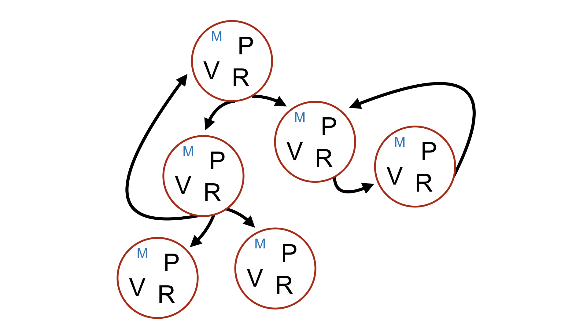
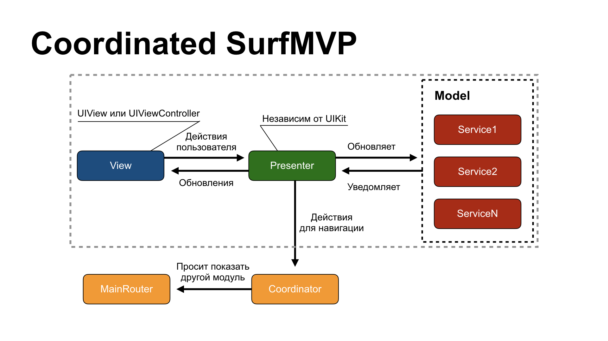
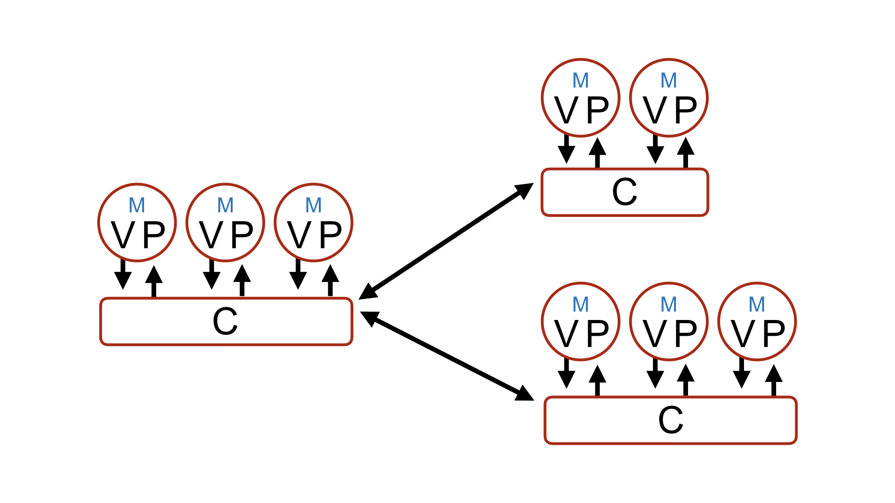

# Coordinated Surf MVP

- [Coordinated Surf MVP](#coordinated-surf-mvp)
  - [Foreword](#foreword)
  - [Architecture in detail](#architecture-in-detail)
  - [Pros and cons of Coordinated SurfMVP](#pros-and-cons-of-coordinated-surfmvp)
    - [Pros](#pros)
      - [Reusability](#reusability)
      - [Navigation](#navigation)
      - [Layout](#layout)
      - [Deeplinks and Push Notifications](#deeplinks-and-push-notifications)
    - [Cons](#cons)
      - [Large coordinators](#large-coordinators)
      - [A lot of code](#a-lot-of-code)
      - [Memory Leaks](#memory-leaks)
  - [UIAlertController and Coordinators](#uialertcontroller-and-coordinators)
  - [When do you use Coordinated SurfMVP?](#when-do-you-use-coordinated-surfmvp)
  - [When don’t you use Coordinated SurfMVP?](#when-dont-you-use-coordinated-surfmvp)
  - [Code generation](#code-generation)

## Foreword

This pattern in architecture is our new take on SurfMVP, the pattern long acknowledged as a standard in our studio. The reason there is a new add-on to SurfMVP is because of navigation issues that started gradually spreading through apps, gaining a slew of complex features that grew harder to implement because we were using routers, entities we had introduced to SurfMVP.



<p align="center">Surf MVP Navigation</p>

Coordinated Surf MVP redefines the concept of navigation in an app and shifts the focus from separate modules by clustering them into groups of modules that perform common actions.

## Architecture in detail

Coordinated Surf MVP is based on the already familiar Surf MVP. Find out more about it [here](Surf_MVP.md).



<p align="center">Coordinated Surf MVP—module</p>

Coordinated SurfMVP is a pattern in architecture where, unlike in SurfMVP, we got rid of an entity called Router, which was inside every single module. The paradigm of building an app has changed slightly. The modules are no longer fully independent. Each module, except for the fully reusable ones, stays in an isolated UserFlow, which is intended to perform a common action leading a user to the desired result.

A set of authorization screens can be an example of such a flow.

In Coordinated SurfMVP, an entity called Router has replaced an entity called [Coordinator](http://khanlou.com/2015/01/the-coordinator/), which is now in charge of navigation inside not just a single module but a set of modules logically connected to each other. This makes navigation and handling of an app much simpler. Here’s what an app would look like schematically:


<p align="center">An app with Coordinated Surf MVP</p>

At the very top, you can see the ApplicationCoordinator, which is in charge of initial routing in an app. Say a user is already authorized. Then we’ll send them straight to the main part of the app. Otherwise, we’ll send them to the authorization screen.

The app now works as follows: every single UserFlow refers to its own coordinator, which, in turn, decides what is going to happen next. The responsibility of transferring data and initiating any further navigation now falls on the Coordinator. It is now in charge of communicating with other modules or coordinators in order to build the navigation stack.



<p align="center">Navigation in Coordinated Surf MVP</p>

## Pros and cons of Coordinated SurfMVP

### Pros

#### Reusability

The main upside to using coordinators is that you can reuse entire blocks of navigation in an app. Now we can call the Coordinator from anywhere in the app and focus solely on it finishing the task.

#### Navigation

Because navigation logic is now isolated in a separate coordinator, keeping track of the navigation has become much easier: all you have to do is open one file to see the big picture. No more going through all the separate modules to trace the connections, building an app, and checking the design.

#### Layout

It’s easier to design the layout with a large team. Simply find time to plot all the navigation and initialize all the modules while you’re designing a new feature, then delegate development to a team of developers, and you’ll run into far fewer issues integrating screens with one another.

To do that, you have to first initialize all the modules and define them in ModuleOutput and ModuleInput. Only then can you fully implement the Coordinator and connect all the modules. All of it could be done by a single person. After this stage, multiple developers can work on multiple modules simultaneously like it’s nothing.

#### Deeplinks and Push Notifications

Integrating Deeplinks and Push Notifications is no longer a headache. With Coordinated SurfMVP, integrating any external navigation is really easy. You can find out more in an article written by [Andrei Panov](https://medium.com/blacklane-engineering/coordinators-essential-tutorial-part-ii-b5ab3eb4a74).

<details>
<summary>About implemmentation</summary>

To keep all the information about navigation together, create a DeepLinksOptions enum, defining all the end modules you eventually need to reach. Then implement the methods to initialize this enum from where Deepllinks and/or Push Notifications are processed.

Then, instances of this enum must be passed through the `start(with deepLinkOption: DeepLinkOption?)` methods until they reach the Coordinator in charge of presenting the screen in question. In doing so, we form a chain of screens to be displayed.

If we receive a DeepLink or Push Notification while the app is running, we must locate the coordinators required to build the app stack and define the `handle(deepLinkOption: DeepLinkOption)` methods that will allow us to reach the correct coordinator without having to recreate anything.

To check if there is a child Coordinator already created you need to use the generic `hasDependency<T>(ofType: T.Type)` method and only then, based on the value obtained, process the start or handle methods.
</details>

### Cons

#### Large coordinators

Because all logic is kept together, it becomes much harder to stay afloat in lines and lines of code. If you forget to follow the single-responsibility principle, then, of course, your coordinator may evolve into a giant monster, and all the pros of code readability will go up in smoke.

#### A lot of code

You have to write a lot to make your code look nice. Because an app has so many layers, each of which is in charge of its own action, you have to battle your way through the layers to find the coordinator you need.

#### Memory Leaks

It’s nothing new, but you have to keep track of it if you don’t want to drop the ball. The main reason people have memory leaks when they use coordinators is that they have retain cycles in module callbacks. So you have to keep a close eye on strong references inside closures.

The main reason we see memory leaks when we use coordinators is that you can use strong references in closures.

<details>
<summary>A typical case</summary>
A typical case is initializing a new Coordinator and implementing closure finishFlow. Capturing a weak coordinator is mandatory; otherwise, the Coordinator will be referencing itself, which would result in a leak in the form of an AuthCoordinator.

```swift
    func runAuthFlow() {
        let coordinator = AuthCoordinator(router: MainRouter())
        coordinator.finishFlow = { [weak self, weak coordinator] in
            self?.removeDependency(coordinator)
        }
        self.addDependency(coordinator)
        coordinator.start()
    }
```
</details>

## UIAlertController and Coordinators

When you are using the Coordinator, all the navigation has to be executed there. The `UIAlertController` alone affects navigation as well. Moreover, it often opens screens as selected by one of the actions.

As a result, in order to use `UIAlertController`, you must first create a separate SurfMVP module that will be presented by the Coordinator. To initialize such modules, we have written a [template](https://github.com/surfstudio/generamba-templates/tree/master/surf_mvp_coordinatable_alert).

## When do you use Coordinated SurfMVP?

- The structure of your screens is complex and subject to frequent change;
- You have Deeplinks and/or Push Notifications with complex navigation;
- Your team is pretty big and you need to either write an app from scratch or implement a large feature with different modules being connected to each other and written by several developers simultaneously.

## When don’t you use Coordinated SurfMVP?

- The project is pretty small and isn’t looking at rapid growth;
- The structure of screens in the project is pretty simple and not subject to drastic changes.

## Code generation

Similar to SurfMVP we’ve created a [Generamba Template](https://github.com/surfstudio/generamba-templates). Find out more about it [here](Surf_MVP.md).

To integrate it into your project, use templates for apps containing coordinators. You can find them [here](https://github.com/surfstudio/Xcode-Project-Templates).