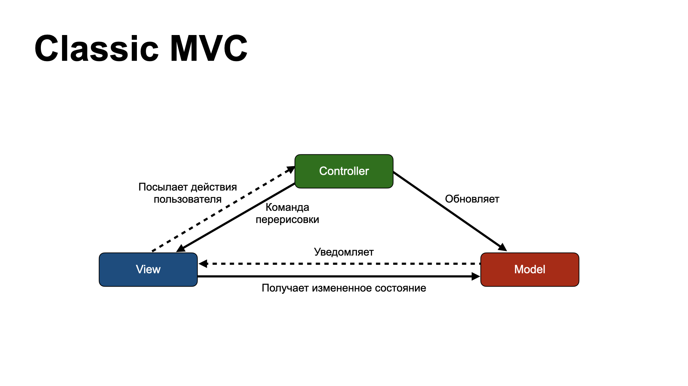
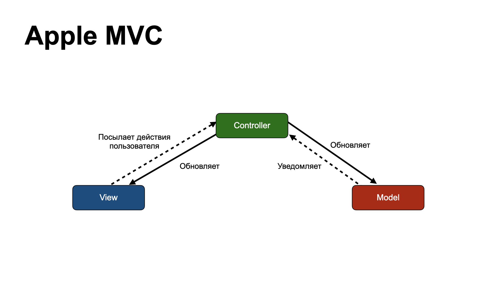
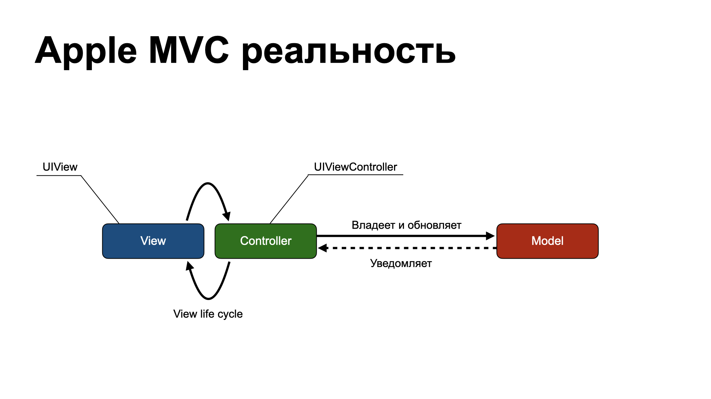
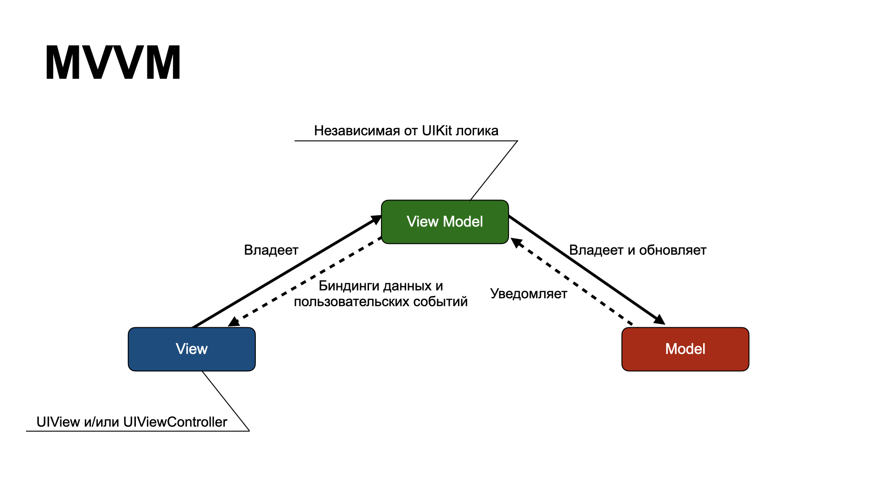
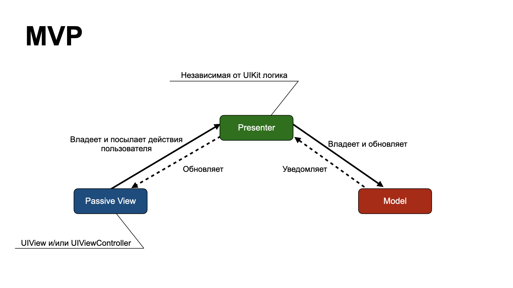
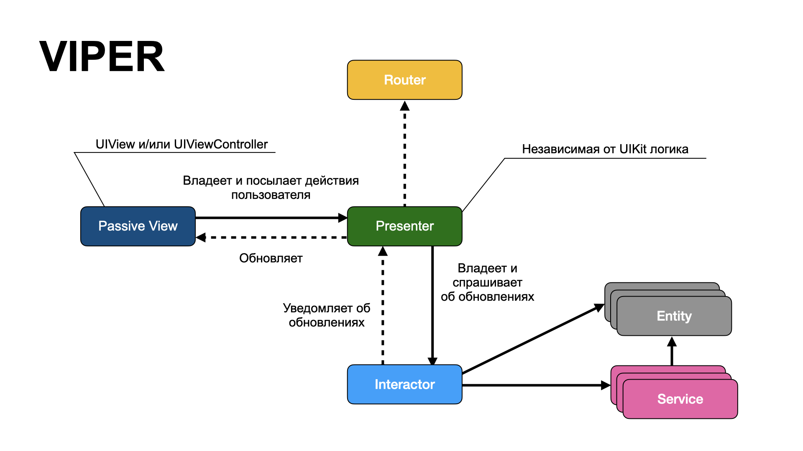
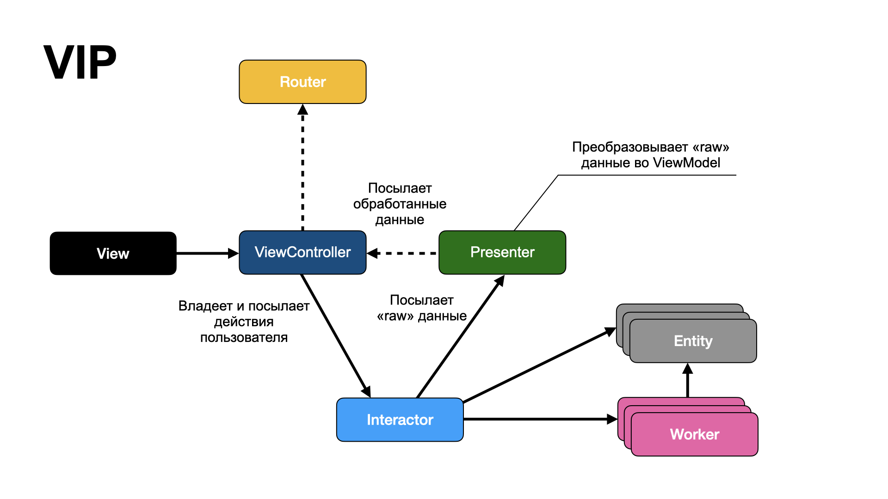
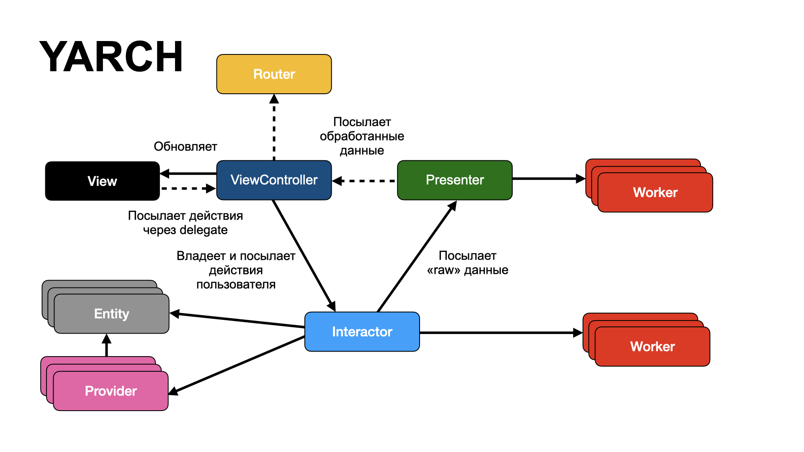

# Архитектуры

## Содержание

- [Предисловие](#Предисловие)
- [Что такое архитектура и какие цели она должна выполнять](#Что-такое-архитектура-и-какие-цели-она-должна-выполнять)
- [Основные архитектуры](#Основные-архитектуры)
  - [MVC 🔃](#MVC-🔃)
  - [Apple MVC 🔃](#Apple-MVC-🔃)
  - [MVVM 🔃](#MVVM-🔃)
  - [MVP 🔃](#MVP-🔃)
  - [Viper 🔃](#Viper-🔃)
  - [VIP ⬆️](#VIP-⬆️)
  - [YARCH ⬆️](#YARCH-⬆️)
- [Архитектурные подходы в Surf](#Архитектурные-подходы-в-Surf)
- [Общие материалы](#Общие-материалы)
- [F.A.Q.]()

**Обозначения:**

- Статья - 📜
- Доклад - 📼
- Материал Surf - 🏄🏻‍
- Двунаправленные архитектуры - 🔃
- Однонаправленные архитектуры - ⬆️

# Предисловие

При разработке современных приложений слово **архитектура**  является предметом споров и холиваров людей с различными жизненными позициями и с различным опытом разработки. Одни пытаются выбрать самую *современную* и *хайповую*, в то время как другие с высоты своего опыта выбирают проверенную временем, обкатанную на десятках проектах. Как показывает практика, истина всегда где-то посередине. Невозможно прямо сейчас назвать одну архитектуру, которая подойдет под любой проект без анализа этого проекта. Поэтому выбор архитектурного шаблона довольно сложный процесс, связанный с анализом всех составляющих будущего приложения. 

# Что такое архитектура и какие цели она должна выполнять

Перво-наперво необходимо понять что представляет собой архитектура, какие проблемы решает и какие цели должна выполнять. И тут важен именно четкий ответ на все три вопроса, поскольку ответ «я знаю, просто не могу объяснить» говорит нам о том, что далеко мы с этим не уедем - мы должны говорить на одном языке и понимать для чего это все делается. 

Так что же является главной целью правильной архитектуры?  Это в первую очередь уменьшение человеческих трудозатрат на **разработку** и **сопровождение** приложения. И именно исходя из этих двух задач архитектурные подходы к разным приложениям могут координально различаться - от разработки одним программистом приложения для одноразового использования, до сложного банковского приложения с возможностью гибкой доработки функциональности. 

Если вы хотите сравнить архитектуры - очень важно подобрать некую *систему координат*, на которую можно будет ориентироваться. 

**По каким параметрам можно сравнивать системы с разными архитектурными подходами:**

- простоту сопровождения - сложность внесения изменений в уже существующий код
- простоту разработки
	- простота входа нового программиста в проект
	- кол-во файлов
	- кол-во строк кода в одном файле
- простоту тестирования
- навигация (роутинг)
- возникаемые проблемы  - в разных подходах обязательно возникают проблемы, которые необходимо решать
- ответственность компонентов (четкая/размытая)
- уровень переиспользования компонентов
- data-flow - поток данных в программе
	- однонаправленный ⬆️
	- двунаправленный 🔃
- возможность командной разработки
- независимость от другого кода -> разнообразие вариантов использования и эффективную работу приложения
	- изолированность от фремворков
	- независимость от пользовательского интерфейса
	- независимость от хранилищ данных
	- независимость от любых внешних сущностей
	- независимость навигации от содержимого модуля

**Важно:** Если рассматривать архитектуры в определенной платформе, то некоторые фреймворки этой платформы накладывают ограничения на архитектурные подходы в приложении. И решая проблему выбора архитектуры, важно не создавать новых более серьезных проблем, чем те, которые решает архитектура. То есть создавая web frontend приложение будет сложно реализовать MVC подход - потому что этот подход ограничит разработчика в определенных действиях и создаст новые проблемы, решение которых не представляется возможным на данной платформе. 

> Архитектура не должна вредить разработке и создавать нерешаемые проблемы

# Основные архитектуры

Мы не будем сравнивать архитектуры по всем параметрам, описанным выше. Вместо этого мы сначала познакомимся, а затем выпишем сильные и слабые стороны каждой из архитектур.

**Общие тенденции последних лет** - переход от двунаправленных 🔃 к однонаправленным ⬆️ архитектурам. Спускаясь по списку все ниже и ниже вы будете замечать, как появляются однаправленные архитектуры. И эта тенденция довольно неплоха - разрабатывать, поддерживать и тестировать однонаправленный поток данных, как правило, проще.

## MVC 🔃

Классический MVC - Model-View-Controller. Эта концепция была описана в конце 70х и получила свое распространение в 80х годах прошлого века. Глядя на диаграмму хорошо видна высокая степень связности всех компонентов этого архитектурного подхода. Однако стоит учитывать, что в те времена пользовательский интерфейс был куда проще, чем сейчас и такой подход был оправдан. 

**Итог:**

- данная архитектура не применима в современной iOS разработке. 

## Apple MVC 🔃

Со времен MVC интерфейс программы сильно изменился и Apple предложила модификацию паттерна - Cocoa MVC: четкое разделение приложения на 3 сущности и двунаправленный поток данных между View и Controller, а так же между Controller и Model. 

Все было бы хорошо, если бы не фреймворк Cocoa Touch, который практически стирает грань между Controller и View. Контроллер вовлечен в жизненный цикл представления, из за чего эти две сущности в один большой файл, который часто называют Massive ViewController. 

**Итог:**
- плюсы
  - низкий порог входа
  - быстрая разработка на старте проекта
- минусы
  - высокая связанность View и Controller
  - плохая тестируемость (из-за связанности)
  - невозможность переиспользования

> PS: На самом деле при умелом и грамотном использовании Apple MVC можно избежать основных проблем - высокая связность View и Controller, но проблема тестирования останется.

**Материалы:**

- [📜 Why I love Apple MVC](https://medium.com/@yesleon/why-i-love-apple-mvc-db97ebc44417)
- [📼 Есть MVC: зачем же нужны другие архитектуры?](https://www.youtube.com/watch?v=z3u1qDao_d8)
- [📜 Документация Apple про MVC](https://developer.apple.com/library/archive/documentation/General/Conceptual/CocoaEncyclopedia/Model-View-Controller/Model-View-Controller.html)
- [📜 Model-View-Controller(MVC) iOS](https://medium.com/@yo.kononov/разбор-вопросов-на-собеседование-junior-ios-developer-dd969ecfbd41)
- [📜 Козел отпущения или MVC в iOS](https://habr.com/ru/post/324414/)

## MVVM 🔃

Одна из самых продвинутых архитектур в MV(x) семействе. 
И в теории она выглядит реально хорошо. 

- MVVM рассматривает `UIViewController` как пассивное представление.
- нет прямой связи между представлением и моделью

К тому же MVVM имеет реактивную версию MVVM, в которой существует биндинги (Reactive bindings) между моделью и ViewModel и между ViewModel и моделью. Но никак не между View и model. 

Так что же такое ViewModel - это `UIKit` независимая прослойка между моделью и представлением. Она получает обновления от модели и обновляет свое состояние и модель, а так как ViewModel имеет связь еще и с представлением, обновляет и его. 

Обычно это относится к реактивному программированию RX. Самый известный фрейморк `RxSwift`, который имеет расширение `RxCocoa` - для обертки компонентов `Cocoa` и `CocoaTouch` в их реактивные обертки. 

**Итог:**

- плюсы
  - ответственность View ниже чем у MVC, но выше чем у MVP, потому что View должна использовать биндинги
  - возможность тестирования ViewModel, так как она ничего не знает про View
  - при реактивном программировании проще прокидывать события в ViewModel и реагировать на них
- минусы 
  - высокий порог входа 
  - сложная отладка

**Материалы:**

- [📜 Не MVC единым: как применять MVVM в iOS](https://stfalcon.com/ru/blog/post/beyond-mvc-how-to-use-MVVM-in-iOS)
- [📜 Освоение MVVM на iOS](https://apptractor.ru/info/articles/osvoenie-mvvm-na-ios.html)
- [📜 MVVM in iOS](https://medium.com/better-programming/mvvm-in-ios-from-net-perspective-580eb7f4f129)
- [📼 Реактивный MVVM](https://www.youtube.com/watch?v=6hVvstMEjoY)

## MVP 🔃

По сути является тем, чем задумывалась Cocoa MVC. Полностью абстрагированный слой представления от логики. 

При использовании этой архитектуры подклассы UIKit рассматриваются как пассивное представление. Посредником между Model и View является Presenter. В него закладывается специфическая логика по обращению к различным ресурсам приложения, но не верстка предоставления. Такой подход обеспечивает хорошую тестируемость логики приложения. 

**Итог:**

- плюсы
  - хорошая тестируемость
  - четкое разделение обязанностей
- минусы
  - долго и муторно пробрасывать изменения между компонентами и экранами
  - сложные UI фишки могут оказаться сложными в реализации (например custom transitions)

**Материалы:**

- [📜 MVP Architecture](https://medium.com/@saad.eloulladi/ios-swift-mvp-architecture-pattern-a2b0c2d310a3)
- [📜 Simple MVP architecture for iOS App](https://medium.com/lovecoding/simple-mvp-architecture-for-ios-app-20fbde0e6ebb)

## Viper 🔃

Отличается от архитектур семейства MV(X) ещё большим разделением обязанностей между слоями. Вместо трёх базовых слоёв VIPER предлагает пять:

- View - полностью пассивное представление.
- Interactor - бизнес-логику, связанную с данными (Entities): например, создание новых экземпляров сущностей или получение их с сервера. Для этих целей вы будете использовать некоторые Сервисы и Менеджеры, которые рассматриваются скорее как внешние зависимости, а не как часть модуля VIPER.
- Presenter - содержит бизнес-логику, связанную c UI (но UIKit-независимую), вызывает методы в Interactor.
- Entities - простые объекты данных, не являются слоем доступа к данным, потому что это ответственность слоя Interactor.
- Router - несет ответственность за переходы между VIPER-модулями.

**Итог:**

- плюсы
  - четкое разделение обязаностей
  - хорошо тестируема
- минусы
  - много файлов и много кода (проблема решается кодогенерацией)
  - сложная коммуникация между экранами
  - overhead для простых проектов
  - популярна на территории СНГ из за чего могут возникнуть сложности с поддержкой кода в США или Европе

**Материалы:**

- [📜 Сравнение архитектур Viper и MVVM](https://habr.com/ru/post/440904/)
- [📜 Разбор архитектуры VIPER](https://habr.com/ru/post/358412/)
- [📜 VIPER Design Pattern](https://medium.com/swift-india/viper-architecture-example-in-ios-in-swift-4-6f656a441f7c)
- [📜 iOS Apps with VIPER (ObjC)](https://www.objc.io/issues/13-architecture/viper/)

## VIP ⬆️

Однонаправленный аналог VIPER. На первый взгляд похож на VIPER, однако отличия становятся видны после изучения принципа взаимодействия модулей. В VIPER основу взаимодействия составляет Presenter, он передает запросы пользователя Interactor’у для обработки и форматирует полученные от него назад данные для отображения на View Controller.

Главный недостаток двунаправленного потока данных в VIPER - Presenter не удовлетворяет SRP потому что он ответственен за:

- подготовку данных для View
- управление действиями на UI

 В Clean Swift (другое название VIP) основными модулями так же, как и в VIPER, являются View Controller, Interactor, Presenter. Взаимодействие между ними происходит циклично. Передача данных основана на протоколах (опять же, аналогично VIPER), что позволяет при будущем изменении какого-то из компонентов системы просто подменить его на другой. 

Процесс взаимодействия в общем виде выглядит так: 
- Пользователь нажимает на кнопку
- View Controller создает объект с описанием и отправляет его в Interactor
- Interactor в свою очередь осуществляет какой-то конкретный сценарий в соответствии с бизнес логикой, создает объект результата и передает его Presenter
- Presenter формирует объект с отформатированными для отображения пользователю данными и отправляет его во View Controller
- Сам же ViewController теперь четко отделяется от View, которая является полностью пассивным слоем

**Итог:**

- плюсы
  - хорошая тестируемость
  - четкое разделение обязанностей
  - просто применить TDD к бизнес логике (интерактор)
  - однонаправленный поток данных 
    - сложнее допустить ошибку
    - проще рефакторинг
- минусы
  - много файлов и много кода (проблема решается кодогенерацией)
  - сложная коммуникация между экранами
  - overhead для простых проектов

**Материалы:**

- [📜 Clean architecture for iOS (VIP as an improvement VIPER)](https://medium.com/@saad.eloulladi/clean-architecture-for-ios-viper-vip-c19de40b71e2)
- [📜 Clean swift архитектура как альтернатива VIPER](https://habr.com/ru/post/415725/)
- [📜 Clean iOS Architecture: VIP (Clean Swift) – Design Pattern or Architecture?](https://www.essentialdeveloper.com/articles/clean-ios-architecture-part-7-vip-clean-swift-design-pattern-or-architecture)
- [📜 Another Interpretation of Clean Architecture with VIP](http://thibaultklein.com/ios/another-interpretation-of-clean-architecture-with-vip/)

## YARCH ⬆️

Еще одна однонаправленная архитектура. Очень похожа на VIP, но имеет еще больше сущностей, что приводит к очевидным достоинствам и недостаткам - много кода, но четкое разделение обязанностей.
Основные элементы:

- Interactor - реализует бизнес логику, но никогда не ходит в сеть или БД за данными
- Provider - это как раз та сущность, которая реализует получение данных из сети или из долговременного хранилища устройства
- Presenter - подготавливает данные для отображение(например форматирование телефона, локализация)
- ViewController - отвечает за отображение состояния, полученного от Presenter, является делегатом единственного View
- View - содержит верстку и публичное API для отображения данных
- Worker - переиспользуемые компоненты бизнес логики(например фильтрация данных)
- ViewModel - обычная DTO без внутренней логики
- Request - структура для передачи данных из ViewController в Interactor
- Response - структура для передачи данных из Interactor в Presenter
- Entity (в исходном описании не упоминается) - как и в VIPER - простые объекты данных, то есть - DTO

**Особенности:**

- для передачи данных между модулями используется первичный ключ, чтобы новый модуль сам обратился к общему хранилищу и получил данные по этому ключу

**Итог:**

- плюсы
  - однонаправленный поток данных
  - четкая ответственность и хорошая тестируемость компонентов
  - высокий уровень переиспользования
- минусы
  - зависит от компании 

**Материалы:**

- [📜 Официальный репозиторий архитектуры](https://github.com/alfa-laboratory/YARCH/blob/master/README-rus.md)
- [📼 Доклад про YARCH](https://www.youtube.com/watch?v=bnQ1djDlrG0)

# Архитектурные подходы в Surf

Мы в Surf осознанно подходим к выбору архитектуры для проектов. Для этого заранее анализируем все цели и возможности проекта и на основе этих данных делаем выбор в ту или иную сторону.

В повседневной разработке мы используем:

- [📜🏄🏻‍🔃 Surf MVP](architectures/Surf_MVP.md)
- [📜🏄🏻‍🔃 Surf MVP+Coordinators](architectures/Surf_MVP_Coordinators.md) – надстройка над SurfMVP призванная упростить навигацию внутри приложения. 

# Общие материалы

- [📜 Основные архитектурные паттерны в iOS](https://stfalcon.com/ru/blog/post/clean-code)
- [📜 iOS architecture patterns](https://thinkmobiles.com/blog/ios-architecture-patterns/)
- [📜 Архитектурные паттерны в iOS от Badoo 2016 года](https://habr.com/ru/company/badoo/blog/281162/) - хорошая статься про основные архитектуры
- [📜📼 про Coordinator в iOS приложениях](https://habr.com/ru/company/oleg-bunin/blog/423299/)
- [📼 Давайте думать над архитектурой](https://youtu.be/QDKR2Ra7IQY?list=PLb1A91j1236qo2oL0Sis_Zf_UUgeMAjDl)

# F.A.Q.

1. **Что важнее в архитектуре: правильность работы или простота изменения?** Второе. Потому что в любой момент требования могут измениться и вы сможете легко заставить программу работать правильно в соответствии с новыми требованиями. 
